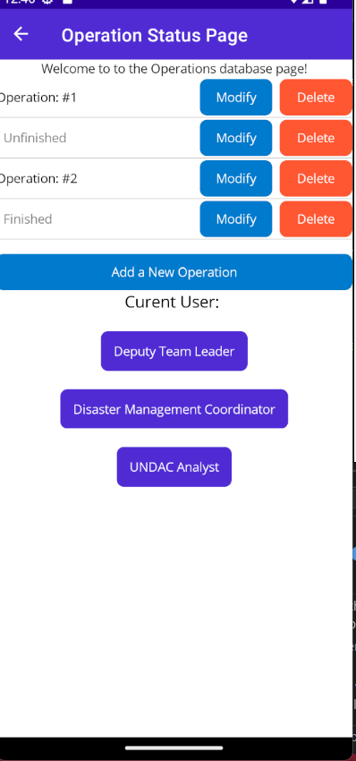
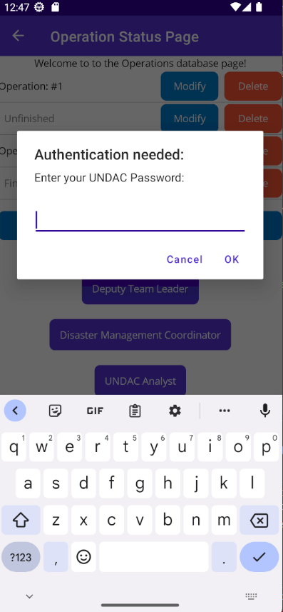
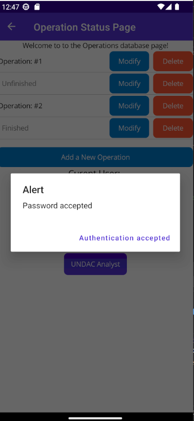
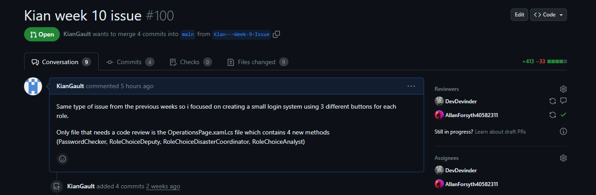
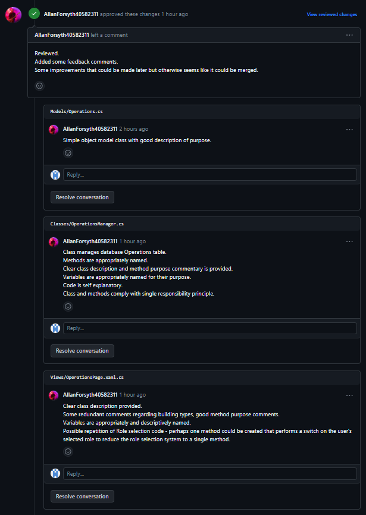
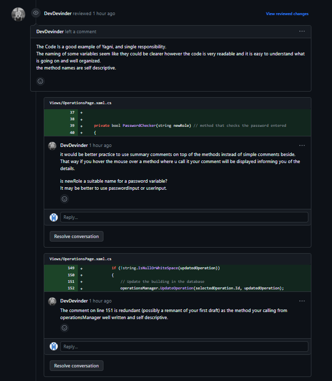
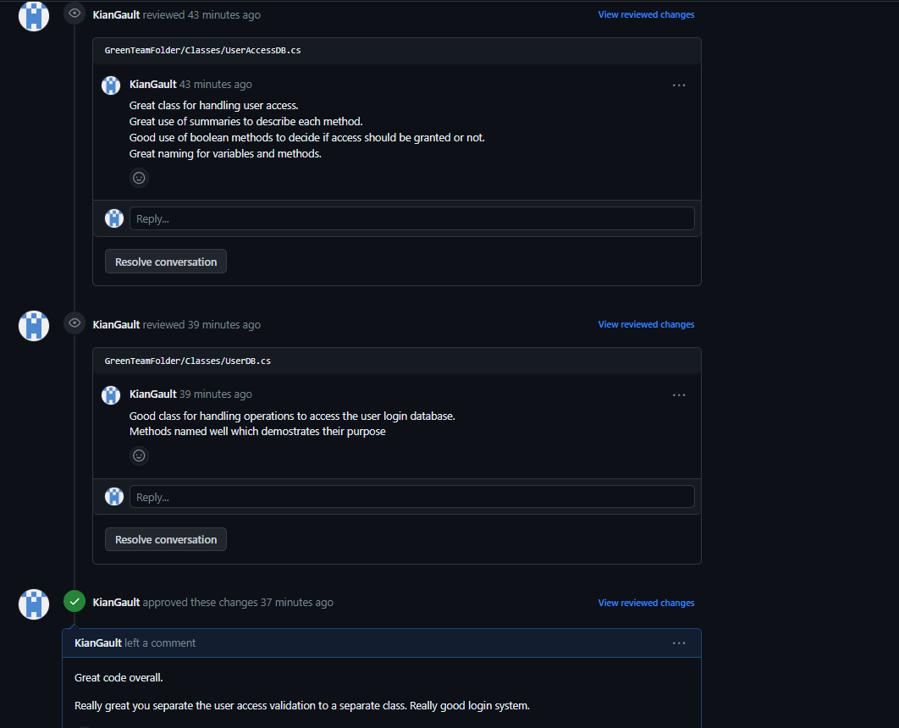

# Project work 2

## Implementing my issue for week 10

User story:
```
As an UNDAC Analyst, I want to view the status of current and completed operations so that 
I can evaluate the effectiveness of the mission

```

For this final week i picked again a similar issue to my previous two. This allowed me to follow up on my previous code to 
improve it. 

This week the focus wasn't on the functionality of the operations but creating a better login system so the different users 
can login and access the database. 

Changes from previous weeks:

The main change this week was changing the login system from a entering your role system to a role select system. This happens 
when the user clicks a button with the role they wish to login to. 



Once clicked, the user is prompted to enter their password. (Note: the password is set to "password" for development purposes)



If the password is accepted the an alert appears and the functionality is added to the database operations granting access. 



## Receiving a code review 

This week to make up for last week not getting a code review done i had two different teammates review my pull request. 

issuing the pull request:


First review: 



The first review critiques the use of comments i have and how some are perhaps from previous iterations which is true. 
This is a small error i missed so the code review was helpful in picking this up. 

The reviewer thought my naming conventions for methods were well selected which i agree with. 


Second Review:



The second reviewer focused on what software engineering principles i used like Yagni and single responsibility. This was 
something i focused on by creating separate methods for each functionality and removing duplicated code. 

One critique the reviewer had was i used single line comments instead of summary comments. I agree these would have been better 
suited. 


## Giving a teammate a code review 

This week i gave a code review to one of my teammates that reviewed mine. 



The main thing i praised in this review was my teammates usage of giving methods/classes a single purpose. This follows the 
single responsibility rule which should always be the goal. 

The main thing they did this with was giving the access code to the database it's own class. So whenever the main operation 
needs to check for authentication it calls this second class. This is great practice. 


## Reflection 

* I believe this week i worked much better with my team in coordinating reviews for each other so we could make the deadline on time. 
* Again, we weren't able to get a testing project to work on our main branch for everyone which is unfortunate. 
* I think my ability to perform code reviews has drastically increased over these project weeks. I can now spot code smells fast. 
* I believe my software skills have also increased as each week i worked on similar issues which allowed me to focus on the quality of the code each week.
