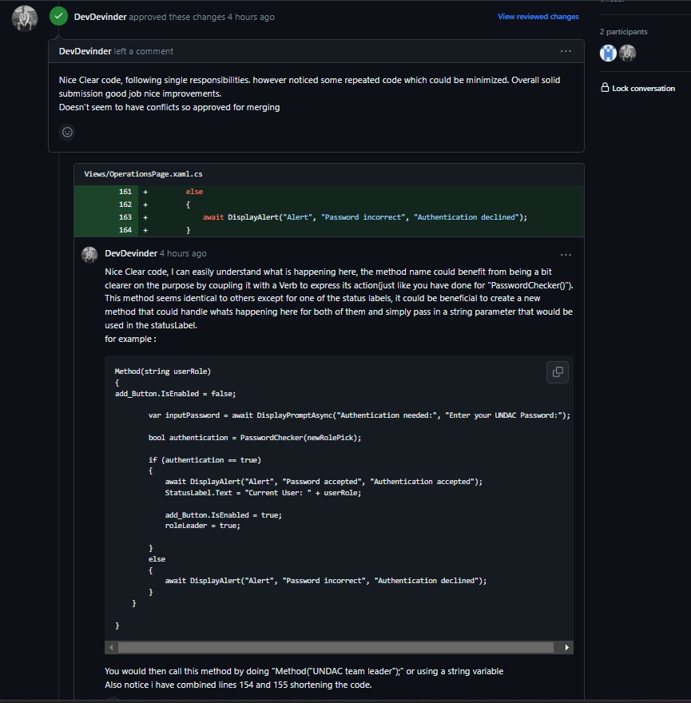
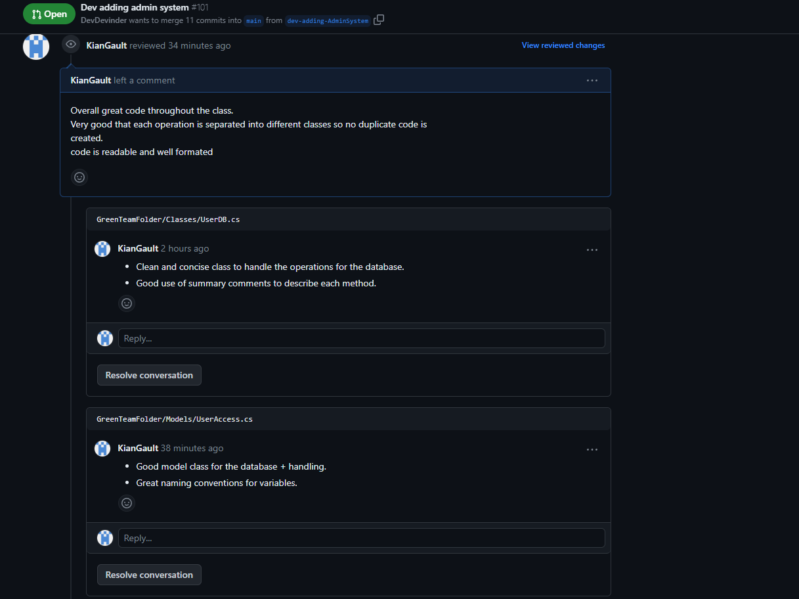

# Project Work - Week 11

## Issue for the week 

```
As an UNDAC Operational Team Leader, I want to abort the operation so that I can keep the team out of danger

```

Like the previous weeks, i picked an issue related to operations so i could improve upon my work from the previous iteration. 
For this weeks issue i had to focus on the team leaders purpose to the app and that is aborting operations when needed. 

The main changes i made this week was amending the code i had for deleting records and changing it to fit this issue. 
This involved adding a team leader role and adding in some exception handing to make sure only this role can perform this action. 

One of the key things implemented this week is the feature to ask for confirmation before an abort is confirmed. This was 
important because aborting an issue removes it from the database which is a crucial action to make by mistake. 

The code snippet:
```
bool choice = await DisplayAlert("Confirmation", "Are you sure you want to delete this record?", "Yes", "No");
            if (choice)
            {


                if (selectedOperation != null)
                {
                    // Delete the building from the database
                    operationsManager.DeleteOperation(selectedOperation.Id);

                    // Remove from the list
                    operations.Remove(selectedOperation);

                    await DisplayAlert("Alert", "Operation Aborted!", "OK");
                }

            }
            else
            {

                await DisplayAlert("Alert", "Abort action cancelled", "OK");
            }
        }
```

As you can see in the code it uses the displayAlert function to gather a boolean answer from the user by clicking either 
yes or no. 


## Receiving a code review 



The feedback i recieved pointed out how i keep the single responsibilities principle throughout my code. 

The main critque of this week is duplicate code which i expected. This is just due to time constraint which i made of note of 
in the application itself. 


## Giving a code review 



This week i have a code review to the same teammate i gave one to last week. I could see he implemented some of the feedback
i suggested the previous review. 

Overall they followed the good coding practices well and implemented their issue effectively. 


## Reflection 

I believe this was my strongest week yet with working on the project. I have felt myself being able to flow with my team 
very well to organise code reviews so i can meet the deadline on time. 

I also think my coding skills have greatly improved with these past few weeks. The fact i picked similar issues for each week 
has let me approach the project weeks like i would as a software engineer with the idea of improving my code with each iteration 
and not getting it perfect first time. 