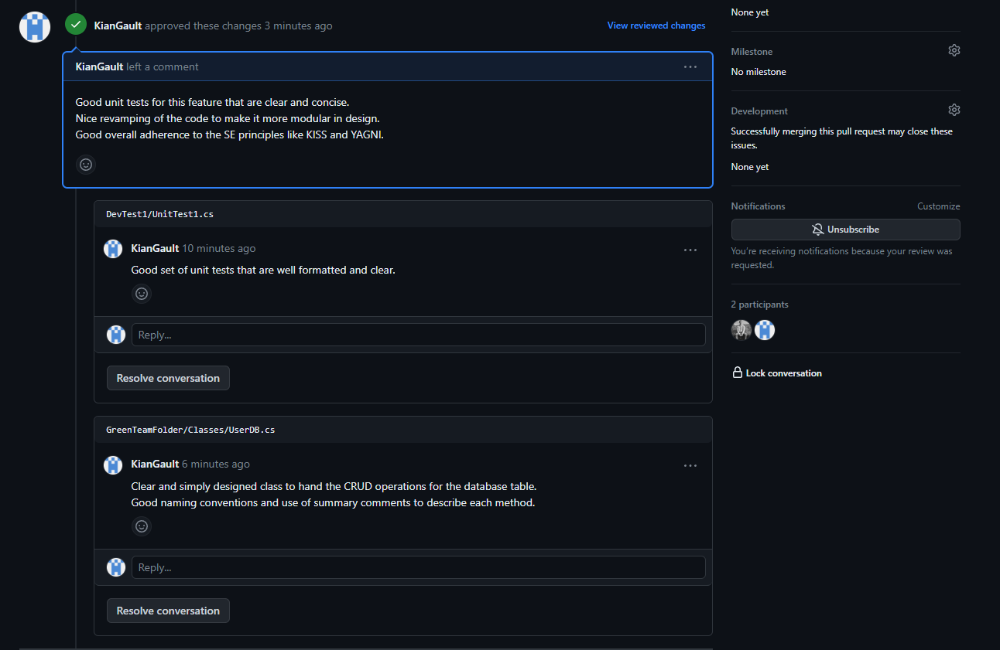

# Implementation

## Issue for this week

```
As an UNDAC Team Member, I want to view the details of current operations that I am part of so that I know what I am required to do
```

To finish off the project week i picked the final issue that related to operations. This task was relatively small because 
i had already added a lot of functionality in the previous week. To complete this week i added new fields that allows the 
user to add a description and date to each operation entry. 

I picked this easier issue for the final week so i could really focus on following up on the feedback i was given from the 
previous code review. This was so i could demonstrate my skill to critique my own code and it's quality to better improve it.


## code changes following last week's code review

The main feedback i got from last week's code review was how i had a lot of duplicated code which is bad practice. This was 
due to having multiple event handler methods doing the same task of authenticating a user based on which user button they selected.

To fix this i created just one single method called "Rolechecker()" which takes in a single string. Here i can put one set of the 
same code i used for all the events and it works just the same. The key difference now is the event handlers just call this one 
method and pass in a string naming the role that was selected. 

This change makes the code more clean and concise in design and removes the duplicated code.

## Code snippet
```
 private async void RoleChecker(string userRole)
    {
        add_Button.IsEnabled = false;

        var password = await DisplayPromptAsync("Authentication needed:", "Enter your UNDAC Password:");

        bool authentication = PasswordChecker(password);

        if (authentication == true)
        {
            
                await DisplayAlert("Alert", "Password accepted", "Authentication accepted");
                StatusLabel.Text = "Current User: ";
                StatusLabel.Text += userRole;
                add_Button.IsEnabled = true;
            
            if(userRole == "Team Leader")
            {
                roleLeader = true;
            }


        }
        else
        {
            await DisplayAlert("Alert", "Password incorrect", "Authentication declined");
        }

    }
    /// <summary>
    /// Method that handles the user choice to pick the deputy team leader role.
    /// </summary>
    private void RoleChoiceDeputy(object sender, EventArgs e)  
    {
        RoleChecker("Deputy Leader");


    }
    /// <summary>
    /// Method that handles the user choice to pick the disaster Coordinator role. 
    /// </summary>
    private void RoleChoiceDisasterCoordinator(object sender, EventArgs e)  
    {
        RoleChecker("Disaster Coordinator");
    }
    /// <summary>
    /// Method that handles the user choice to pick the Analyst role
    /// </summary>
    private void RoleChoiceAnalyst(object sender, EventArgs e)  
    {
        RoleChecker("Analyst");
    }
    /// <summary>
    /// Method that handles the user choice to pick the team leader role
    /// </summary>
    private void RoleChoiceLeader(object sender, EventArgs e) 
    {
        RoleChecker("Team Leader");
    }
    /// <summary>
    /// Method that handles the user choice to pick the team member role
    /// </summary>
    private void RoleChoiceMemeber(object sender, EventArgs e)
    {
        RoleChecker("Team Member");
    }
    
```

## Receiving a code review


## Giving a code review



## Reflection 
To reflect on this final project week i think i have showed great skill and progression as the weeks went on with my coding 
and software engineer thinking. This is because each week i followed up on the previous weeks feedback to improve the code 
i had made. 

I believe my communication with my team could have been better overall but this was also down to timing and fast deadlines so 
getting the whole team together was only possible once a week. I have been able to communicate enough to make sure all the team
are handling their weekly issue okay and have put myself in the position to deliver code reviews and receive them. 

I also believe my ability to spot code smells has greatly improved each week which has made me less likely to make these small
but noticeable coding mistakes when implementing my issue. It also greatly helped that i selected related issues for each week as 
it allowed me to treat these project weeks as an agile development project. So instead of creating perfect software on the first 
week i focused on improving each week instead and slowly adding more.
