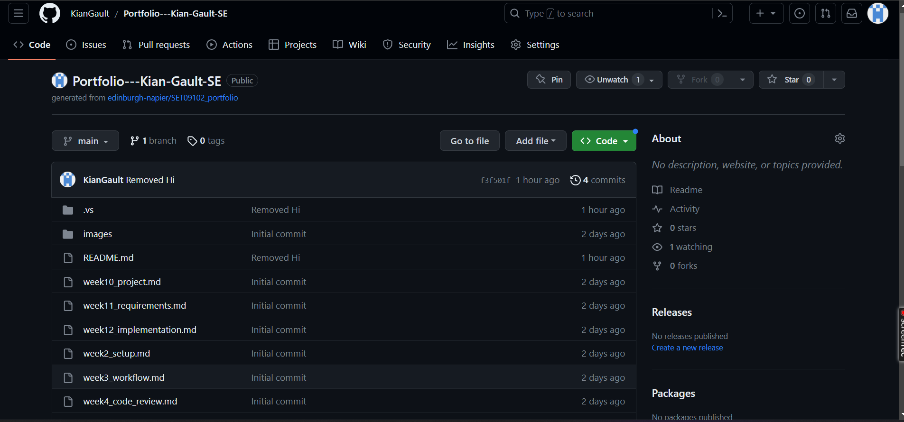
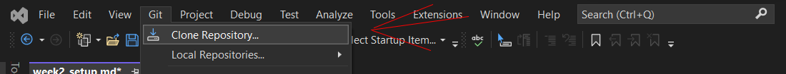

## Setup - Kian Gault 

This file serves as evidence of my setup configurations for Week 2 of the Software Engineering Module. 

## Environment configuration

<ins> Personal Portfolio Setup <ins>

- This image shows my own repository. 
- I achieved this by pressing the <ins>+</ins> arrow to create a new respository. 
- Instead of creating a repository from scratch i copied the template repository provided by cloning the existing repostory.
- Lastly i then clone this repository to a local Virtual Studio repository as shown in the image below.

## Reflection

For this section, decide what points are worth making and structure your content 
appropriately.

**DO**

* Use sub-headings to differentiate between sections
* Provide <ins>reflective</ins> commentary that discusses, for example, limitations of
  your current configuration, how your configuration is appropriate for the current 
  project, alternative configuration that might be appropriate in ther circumstances, 
  etc.
* Mention any difficulties you had setting up your working environment and how you 
  resolved them

**DON'T**

* Repeat the descriptive commentary from point 1
* Give a blow-by-blow account of everything you did. Instead, you should highlight 
  the important points.
