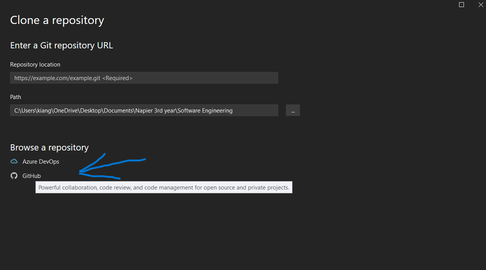

## Setup - Kian Gault 

This file serves as evidence of my setup configurations for Week 2 of the Software Engineering Module. 

## Environment configuration

<ins> Personal Portfolio Setup <ins>

- This image shows my own repository. 
- I achieved this by pressing the <ins>+</ins> arrow to create a new respository. 
- Instead of creating a repository from scratch i copied the template repository provided by cloning the existing repostory.
- Lastly i then clone this repository to a local Virtual Studio repository as shown in the image below.

- Next we are brought to this screen and we can select the GitHub tab for quicker access to the GitHub repository linke
- <ins> Note: You have to be logged into your GitHub account on Visual Studio for this option <ins> 
- Alternatively you can just copy the url of your GitHub repository 

- When you click on the GitHub option you are brought to this screen:

- As you can see all your repositories for your account are displayed. 
- Simply pick the respository you wish to clone then press the clone button. 

- The screenshot below shows the respository cloned onto your visual studio environment
- This is a local respository meaning you can edit the files within it without changing the cloud version

<ins> Creating a shared GitHub repository for the team <ins> 

- For this we discussed among ourselves and naturally some of us became leaders and set up a repository
- We then gathered every email of our team members then sent out invites to the created repository
- Once invited we all had to personally clone the respository to our local visual studio machine

- Below we can see the shared repository 

- Below is my own cloned version of our shared repository 

## Reflection

For this section, decide what points are worth making and structure your content 
appropriately.

**DO**

* Use sub-headings to differentiate between sections
* Provide <ins>reflective</ins> commentary that discusses, for example, limitations of
  your current configuration, how your configuration is appropriate for the current 
  project, alternative configuration that might be appropriate in ther circumstances, 
  etc.
* Mention any difficulties you had setting up your working environment and how you 
  resolved them

**DON'T**

* Repeat the descriptive commentary from point 1
* Give a blow-by-blow account of everything you did. Instead, you should highlight 
  the important points.
