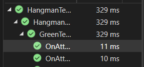

# Testing

## Unit Test Examples - Author: Myself Kian Gault 
```
 [Fact]
 public void OnAttemptSubmitted_WithNoRemainingAttemptsAvailable()
 {
     var gameLogic = new GamePage("Easy");
     bool gameOverCalled;


     // Set remainingAttempts to a value greater than 0
     gameLogic.remainingAttempts = 0;

     // Act
     if (gameLogic.remainingAttempts == 0)
     {


         gameOverCalled = true;

     }
     else
     {
         gameOverCalled = false;
     }


     // Assert
     // Check if the gameOverCalled flag is true, indicating that GameOver was called
     Assert.True(gameOverCalled);


 }
 ```

 ```
  public void OnAttemptSubmitted_WithRemainingAttemptsAvailable()
 {
     var gameLogic = new GamePage("Easy");
     bool gameOverCalled;
     

    
     gameLogic.remainingAttempts = 3;

     // Act
     if (gameLogic.remainingAttempts == 0)
     {


         gameOverCalled = true;

     }
     else
     {
         gameOverCalled = false;
     }

     // Assert
     // Check if the gameOverCalled flag is true, indicating that GameOver was called
     Assert.True(gameOverCalled);
 }
 ```

 ## Results when running the two unit tests 
 


 ## Purpose of the two unit tests 
 The purpose of these tests were to test the two possible scenarios that can happen with the method "AttemptSubmitted" which 
 checks the current life count of the player to see if they can continue or not. 

 The tests respectively test the two options with one having no lives remaining and one having lives remaining. Both tests result 
 in a pass because we expect the result to be true or false. There should be no other possible outcomes when it comes to this 
 method unless a coding error occurred. 


 ## Why was this method important to test
 This was a crucial method to the application because it handles the life count of the player which keeps the rules of the game 
 fair. If the player runs out of lives they shouldn't be able to continue the game or there would be no challenge. These two 
 tests make sure this stays the case. 


 ## Reflection 
 This week was my first attempt at using built-in automatic tests using visual studio as beforehand i had only used manual unit 
 testing. So this was an adaptive and informative experience. 

 As a team we ran into significant issues getting our tests to run in the same repo as well. 

 For my own written unit tests, they are written in a very simple and rigid manner, but this was more to test myself on using 
 xUnit for the first time and getting a test to run successfully.
