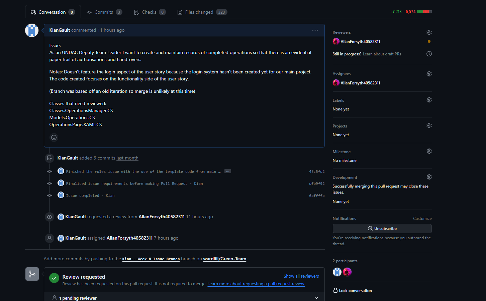

# Project work 1

## What i worked on this week
This week i selected the issue below to implement in our team app. 
```
As an UNDAC Deputy Team Leader I want to create and
maintain records of completed operations so that there is an evidential 
paper trail of authorisations and hand-overs.
```
After completing this issue i submitted a pull request and paired with Allan Forsyth from my team so we could both 
finish each other's pull requests. 

## Implementing the issue 
Completing the issue was somewhat of an easy task because i had finished a similar designed issue from week 3 which involved 
using an SQLite database so finishing this new issue was more of the same. 

The issue was implemented correctly but in design it is rather straight forward. This is good for a first iteration but it 
should be further developed later on. 

Additionally there is a lot of duplicated code since the week 3 issue is really similar so the code is as well. Future updates 
should fix this by making one class to handle SQL actions instead of multiple. 

## Giving a code review to a teammate 
I paired with a teammate to review their completed issue using the github flow. I checked each new class and gave comments to 
each of them. The screenshots below are from the code review on his pull request 


## Recieving a code review 
I submitted my issue with a pull request to our team repo and assigned my teammate to the code review. 
This follows the Github workflow method. 
Unfortunately scheudling has made it hard for the review to be finished on time but the workflow was followed regardless. 




## Reflection 
I felt i worked well this week with communicating with my team. I was able to set up a pair code review with a teammate and 
was able to get my issue finished and working. 

As a team we didn't set up a testing project in our main repo so completing a unit test for the issue wasn't possible without 
creating merge conflicts in our issue branches. This will be fixed for the next issues that we will do. 

My code review not being finished was unfortunate but also natural with timing issues and limitations of the time constraint 
of this deadline entry. The workflow was still followed which lets me know i understand it. 

