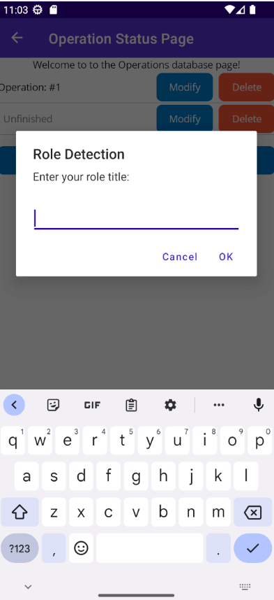
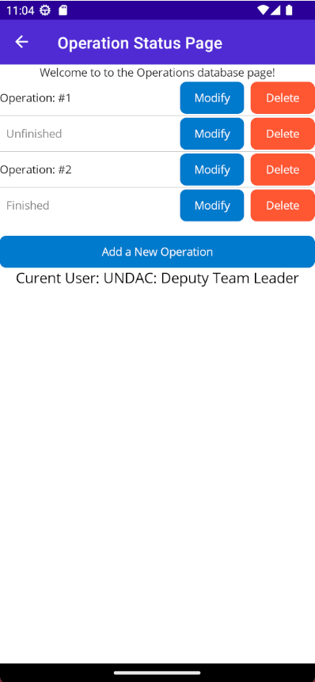

# Project work 2

## Selecting and finishing an issue from the week 9 list 
```
User story:
[As an UNDAC Disaster Management Coordinator, I want to create and manage operations so that the mission requirements can be fulfilled #86]
```

I selected this issue because it was close in design as my previous issue. This is a good thing because it allowed me to treat
this project like a real agile development project. So for this week instead of creating new classes/features i focused on 
imrpoving the code i made last week by applying the code quality principles i have learned on this module. 

## New features 

One of the features that was needed to improve this operations page was a role detection method. This is because the main 
difference between this and last week's issues are the roles are different, so we need a way to determine this. 

For this build it is pretty simple in design but this should be the case at first until future installments to improve it. 



The second feature i added was a new field to the SQL table called status. This allows the user to enter a status for the operation
(finished or unfinished). This allows the UNDAC employees to manage operations better. 



These features helped make the software better than the previous iteration of the project. This is the main goal when following 
agile to imrpove the code each sprint which i showed here. 

## Changes to the code from last week following the code review

Following the code review i received from last week there was some suggested changes which i took on board. One was i had a few 
instances of duplicated code. To counter this, i created a new method which can be called with the code inside it. This allowed
me to follow the principle of KISS and reduce complexity. 

I appricated the feedback i got from my teammate as it allowed me to make my code better. 


## Giving a teammate a code review 

(Under development)
- Was unable to give my teammate a code review due to them not submitting a PR like we arranged. 

## Recieving a code review 

(Under development)
- Didn't recieve my code review in time for the deadline submission. 


## Reflection 
I believe this week i showed good software engineering practice with handling my issue. I followed the agile approach and
made my focus on improving my code from last week which follows the agile sprint protocol. 

I also used my code review from last week to make my code better this week which demostrates my ability to take feedback 
constructively to improve my skill as a software developer. 

As a team we weren't able to get a test project to work with our MAUI app so this is something we hope to try and fix in the 
future.  
